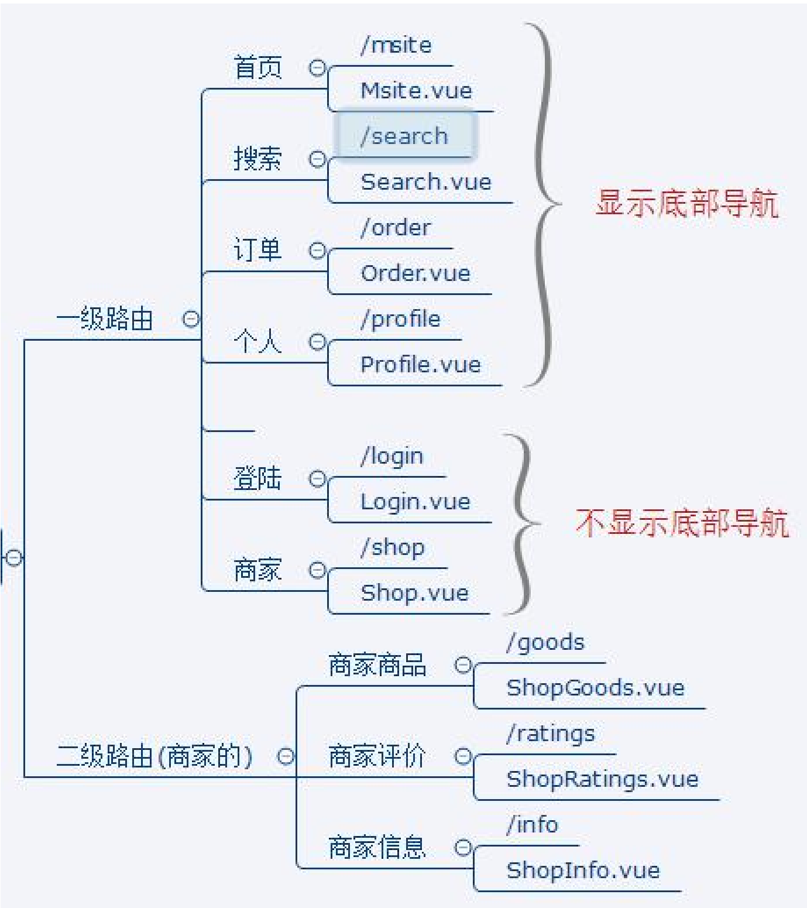
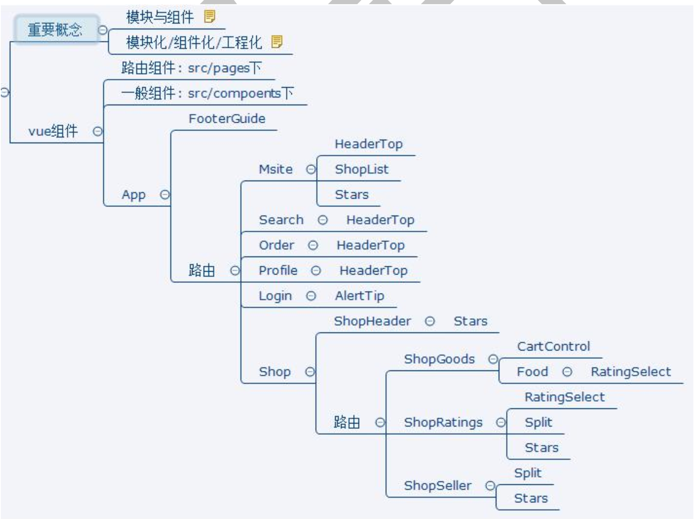

# 开发路线

## 1. 项目开发准备

* 项目描述: 外卖项目
* 技术选型: vue(前端) + express(后端) + mongodb(数据库)
* 三方组件: mint-ui, better-scroll, swiper, moment, date-fns, mock, 容联云通信(短信服务)
* API接口: server-api 服务, 启动即可, 只有用户信息用到了数据库, 其余是一些静态数据和网络接口

## 2. 开启项目开发
0. 创建项目
   * 使用脚手架创建项目:
   * npm install -g @vue/cli  &&  vue create vue-phone-gshop
   * 安装所有依赖/指定依赖
1. 页面路由拆分.
   * 首页, 外卖, 搜索, 订单, 我的页面.
   * 登陆页面, 个人中心页面.
   * 详细页面. 点餐, 评价, 商家 子页面.
   * 
2. 组件拆分.
   * 首页底部导航(可显隐). 路由的 meta
   * 
3. 公共组件抽取.
   * ajax请求封装.

## 3. 异步数据+Vuex

```plaintext
    封装ajax:
        promise+axios封装ajax请求的函数
        封装每个接口对应的请求函数(能根据接口定义ajax请求函数)
        解决ajax的跨越域问题: 配置代理, 对代理的理解
    vuex编码
        创建所有相关的模块: store/index|state|mutations|actions|getters|mutation-types
        设计state: 从后台获取的数据
        实现actions:
            定义异步action: async/await
            流程:　发ajax获取数据, commit给mutation
        实现mutations: 给状态赋值
        实现index: 创建store对象
        main.js: 配置store
    组件异步显示数据
        在mounted()通过$store.dispatch('actionName')来异步获取后台数据到state中
        mapState(['xxx'])读取state中数据到组件中
        在模板中显示xxx的数据
    模板中显示数据的来源
        data: 自身的数据(内部改变)
        props: 外部传入的数据(外部改变)
        computed: 根据data/props/别的compute/state/getters
    异步显示轮播图
        通过vuex获取foodCategorys数组(发请求, 读取)
        对数据进行整合计算(一维变为特定的二维数组)
        使用Swiper显示轮播, 如何在界面更新之后创建Swiper对象?
            1). 使用回调+$nextTick()
            2). 使用watch+$nextTick()
```

# 组件描述

## 1. ShopHeader组件

```text
    1). 异步显示数据效果的编码流程
        ajax
          ajax请求函数
          接口请求函数
        vuex
          state
          mutation-types
          actions
          mutations
        组件
          dispatch(): 异步获取后台数据到vuex的state
          mapState(): 从vuex的state中读取对应的数据
          模板中显示
    2). 初始显示异常
        情况1: Cannot read property 'xxx' of undefined"
        原因: 初始值是空对象, 内部没有数据, 而模块中直接显示3层表达式
        解决: 使用v-if指令
  
        情况2: Cannot read property 'xxx' of null"
   
    3). vue transition动画
```

## 2. ShopGoods组件

```text
    1). 动态展现列表数据
    2). 基本滑动:
        使用better-scroll
        理解其基本原理
        创建BScroll对象的时机
          watch + $nextTick()
          callback + $nextTick
    3). 滑动右侧列表, 左侧同步更新
        better-scroll禁用了原生的dom事件, 使用的是自定义事件
        绑定监听: scroll/scrollEnd
        滚动监听的类型: probeType
        列表滑动的3种类型
            手指触摸
            惯性
            编码
        分析:
            类名: current 标识当前分类
            设计一个计算属性: currentIndex
            根据哪些数据计算?
              scrollY: 右侧滑动的Y轴坐标 (滑动过程时实时变化)
              tops: 所有右侧分类li的top组成的数组  (列表第一次显示后就不再变化)
        编码:
            1. 在滑动过程中, 实时收集scrollY
            2. 列表第一次显示后, 收集tops
            3. 实现currentIndex的计算逻辑
    4). 点击左侧列表项, 右侧滑动到对应位置
```

## 3. CartControl组件

1). 问题: 更新状态数据, 对应的界面不变化
原因: 一般方法给一个已有绑定的对象中添加一个新的属性, 这个属性没有数据绑定
解决:
Vue.set(obj, 'xxx', value)才有数据绑定
this.$set(obj, 'xxx', value)才有数据绑定

## 4. ShopCart组件

1). 使用vuex管理购物项数据: cartFoods
2). 解决几个功能性bug

## 5. Food组件

1). 父子组件:
子组件调用父组件的方法: 通过props将方法传递给子组件
父组件调用子组件的方法: 通过ref找到子组件标签对象

## 6. ShopRatings组件

1). 列表的过滤显示
2). 自定义过滤器

## 7. ShopInfo组件

1). 使用better-scroll实现两个方向的滑动
1). 通过JS动态操作样式
2). 解决当前路由刷新异常的bug

## 8. Search组件

1). 根据关键字来异步搜索显示匹配的商家列表
2). 如实实现没有搜索结果的提示显示

# 项目优化

1). 缓存路由组件对象
2). 路由组件懒加载
3). 图片司加载: vue-lazyload
4). 分析打包文件并优化
